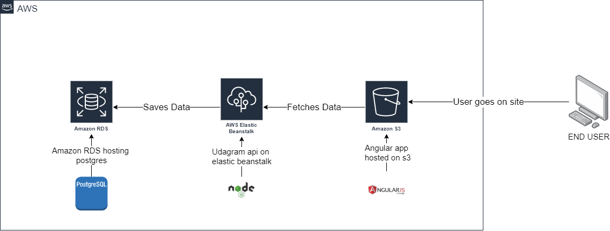

# Infrastructure

## AWS services in use

- **RDS**
  - provides a public accessible PostgreSQL database
- **S3**
  - provides the frontend hosting
  - and a place where the backend saves uploaded images
- **Elastic Beanstalk**
  - provides the backend hosting

## Infrastracture Schema

